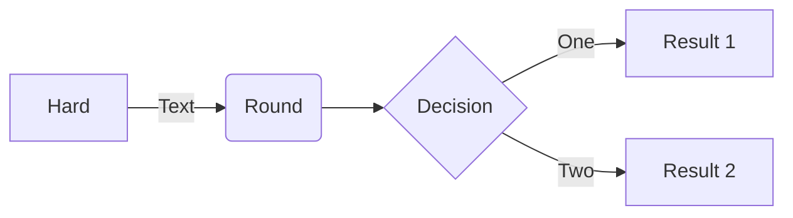
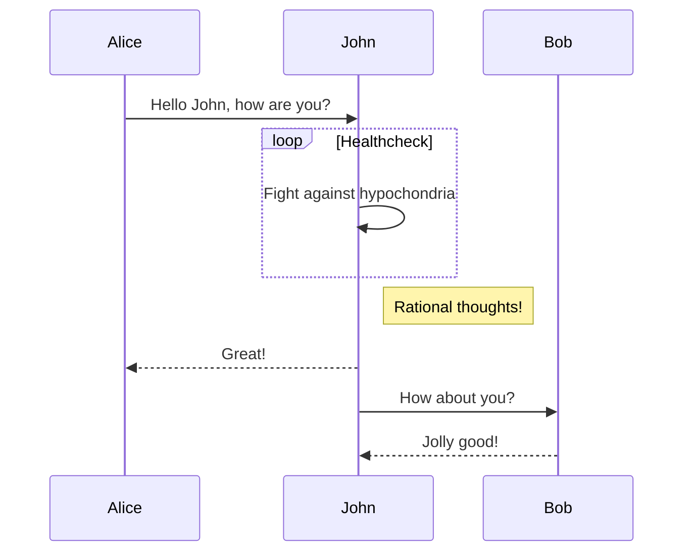
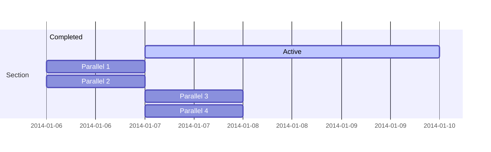
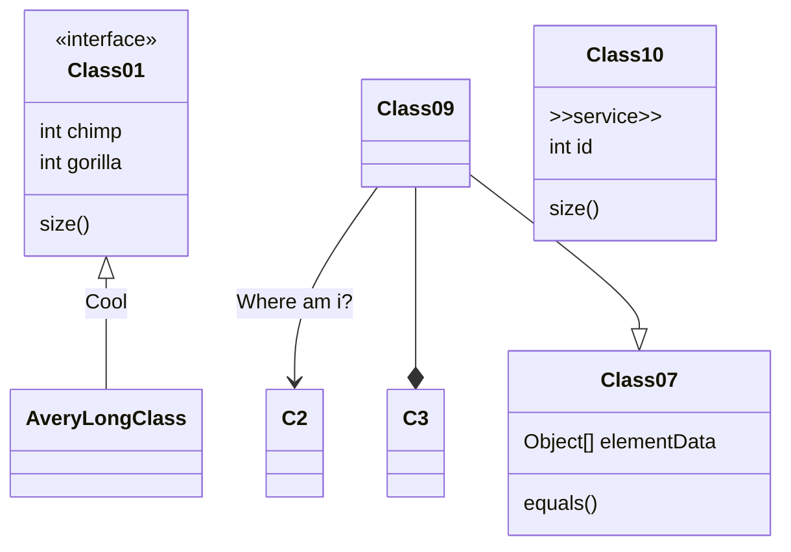
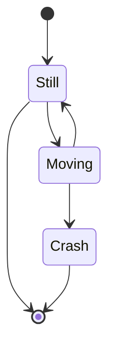
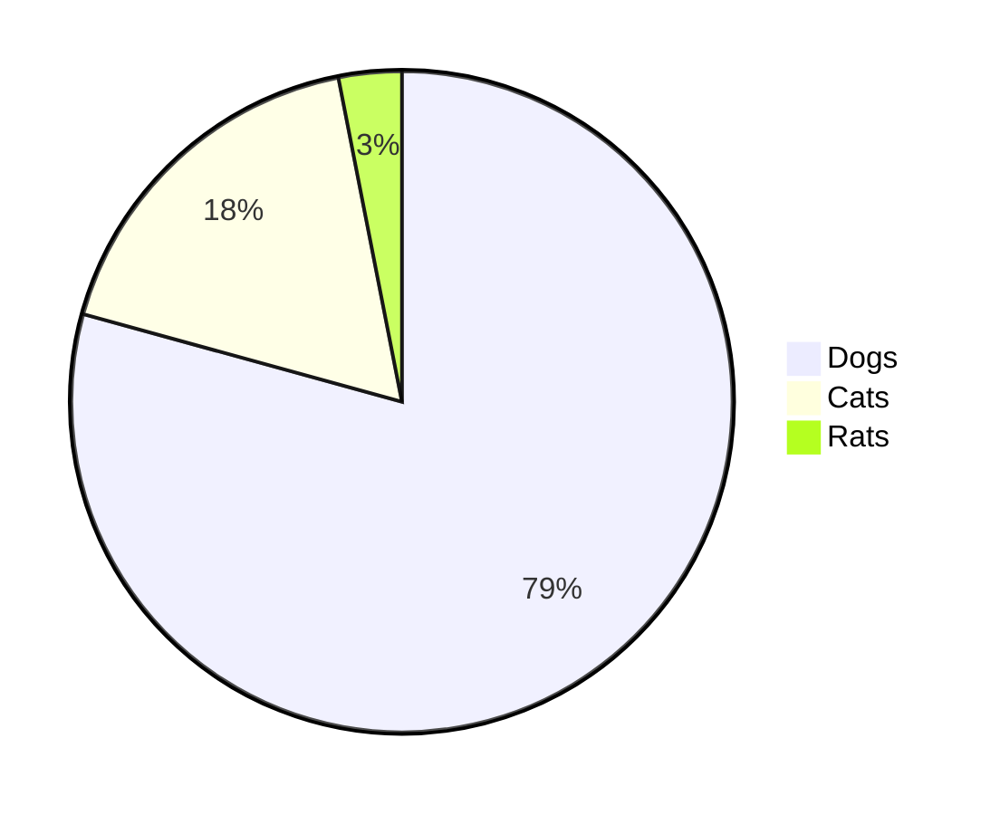
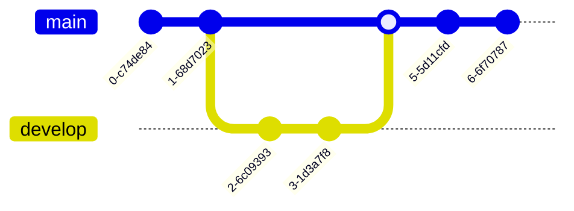
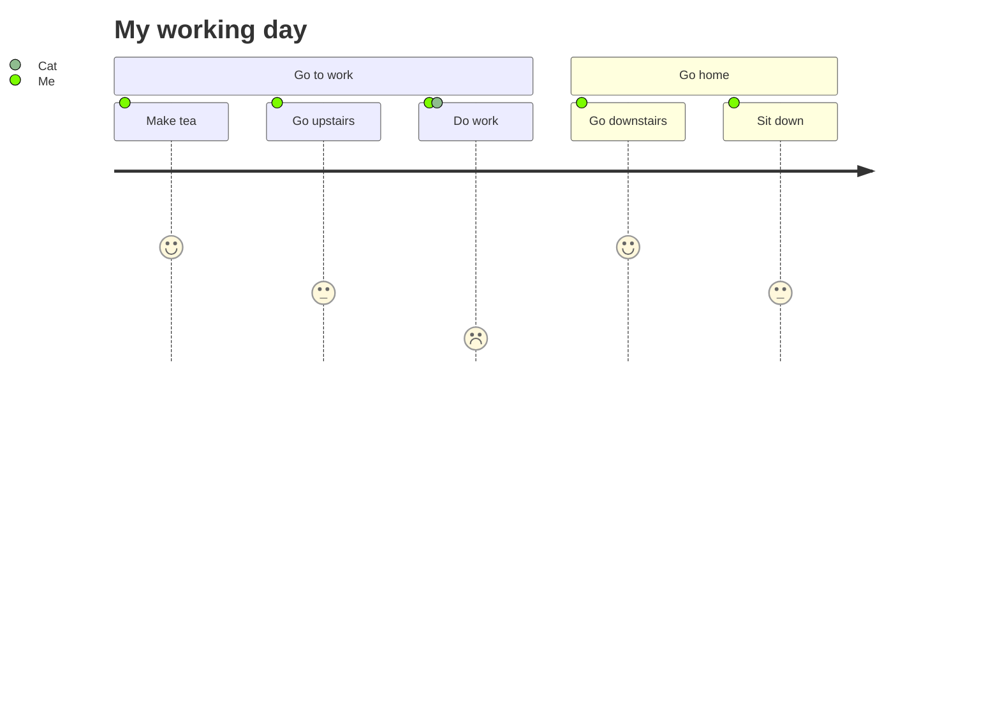
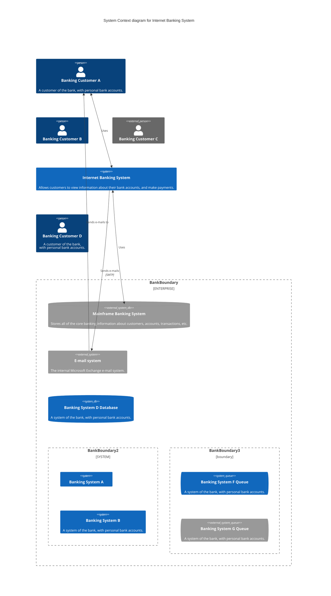

## Flowchart

## Sequence diagram

## Gnatt Chart

## Class diagram

## State diagram

## Pie Chart

## Git Graph

## Bar chart (using gantt chart)

```mermaid
gantt
    title Git Issues - days since last update
    dateFormat  X
    axisFormat %s

    section Issue19062
    71   : 0, 71
    section Issue19401
    36   : 0, 36
    section Issue193
    34   : 0, 34
    section Issue7441
    9    : 0, 9
    section Issue1300
    5    : 0, 5
```

## User Journey diagram

## C4 diagram

